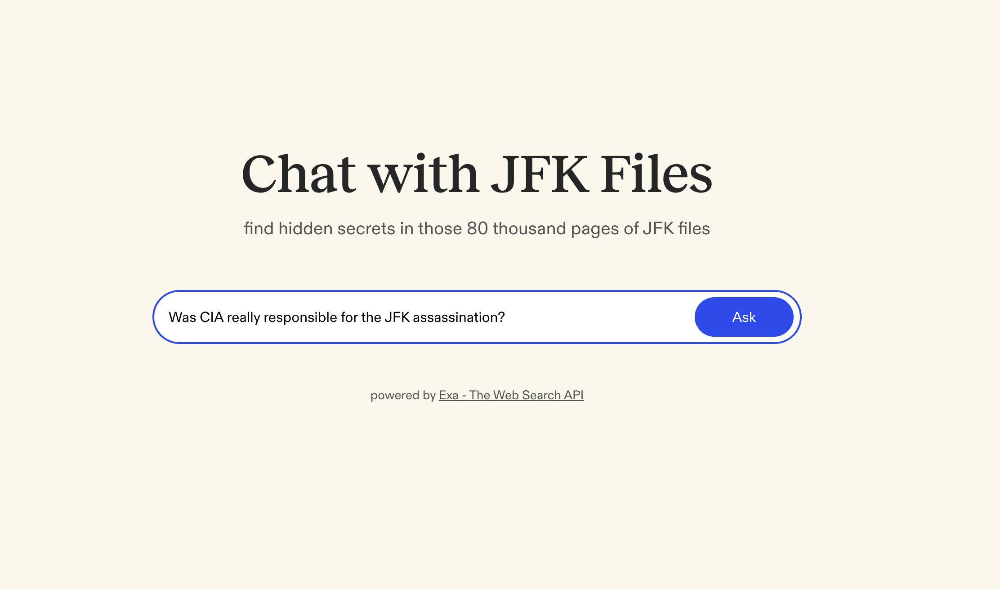

# 💬 JFK Files Chat App
### Powered by [Exa](https://exa.ai) - The Web Search API

### Try the tool: [JFK Files Chat App](https://jfk-files-app.vercel.app/)



<br>

## 🎯 What is JFK Files Chat App?

The JFK Files Chat App is a free and opensource chat tool that lets you ask questions about the JFK assassination files that were just made public. It uses Exa to search through these files and an AI to help explain them in a way that's easy to understand.

Ask questions about the JFK files and receive responses backed by official documents from the National Archives.

<br>

## 💻 Tech Stack
- **Search Engine**: [Exa API](https://exa.ai) - Web search API, now with JFK files
- **Language Model**: Anthropic Claude 3.7 Sonnet
- **Frontend**: [Next.js 14](https://nextjs.org/docs) with App Router, [TailwindCSS](https://tailwindcss.com), TypeScript
- **AI Integration**: [Vercel AI SDK](https://sdk.vercel.ai/docs/ai-sdk-core)
- **Hosting**: [Vercel](https://vercel.com/)

<br>

## 🚀 Getting Started

### Prerequisites
- Node.js
- Exa API key
- Anthropic API key

### Installation

1. Clone the repository
```bash
git clone https://github.com/exa-labs/jfk-files-app.git
cd jfk-files-app
```

2. Install dependencies
```bash
npm install
```

3. Set up environment variables (for Exa and Anthropic)
```bash
cp .env.example .env.local
# Edit .env.local with your API keys
```

4. Run the development server
```bash
npm run dev
```

5. Open http://localhost:3000 in your browser

<br>

## 🔑 API Keys & Environment Setup

### Required API Keys
* **Exa API Key**: Get from [Exa Dashboard](https://dashboard.exa.ai/api-keys)
* **Anthropic API Key**: Get from [Anthropic Console](https://console.anthropic.com/settings/keys)

<br>

## ⭐ About [Exa](https://exa.ai)

This project is powered by [Exa.ai](https://exa.ai), a web search API designed specifically for AI applications. Exa provides:

* Real-time web search capabilities
* Enhanced response accuracy through current information
* Comprehensive search results from JFK files and archives

[Try Exa API](https://dashboard.exa.ai)

<br>

---

Built with ❤️ by the Exa team
